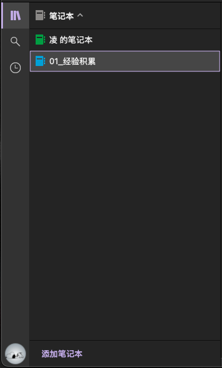
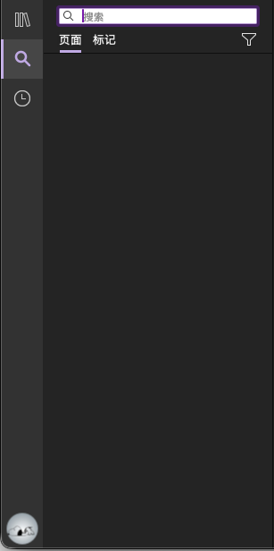
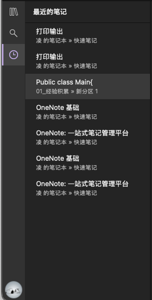
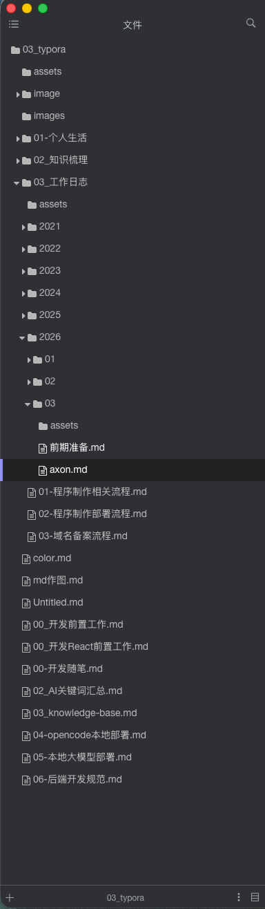
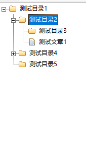

[toc]

# 一、需求分析

标签栏的位置定义错误, 
英雄区分为4个区域

目录渲染, 需要开通权限才可以, 示例 : 
~~~json
{
  "$schema": "../gen/schemas/desktop-schema.json",
  "identifier": "default",
  "description": "Capability for the main window",
  "windows": ["main"],
  "permissions": [
    "core:default",
    "core:window:allow-set-theme",
    "opener:default",
    "fs:default",
    "fs:allow-read-text-file",
    "fs:allow-write-text-file",
    "fs:allow-exists",
    "fs:allow-mkdir",
    "fs:allow-read-dir",
    {
      "identifier": "fs:scope",
      "allow": [{"path": "**"}]
    },
    "dialog:default",
    "dialog:allow-open",
    "dialog:allow-save",
    "dialog:allow-message",
    "dialog:allow-ask",
    "store:default"
  ]
}
~~~

目录区设计 参考 

